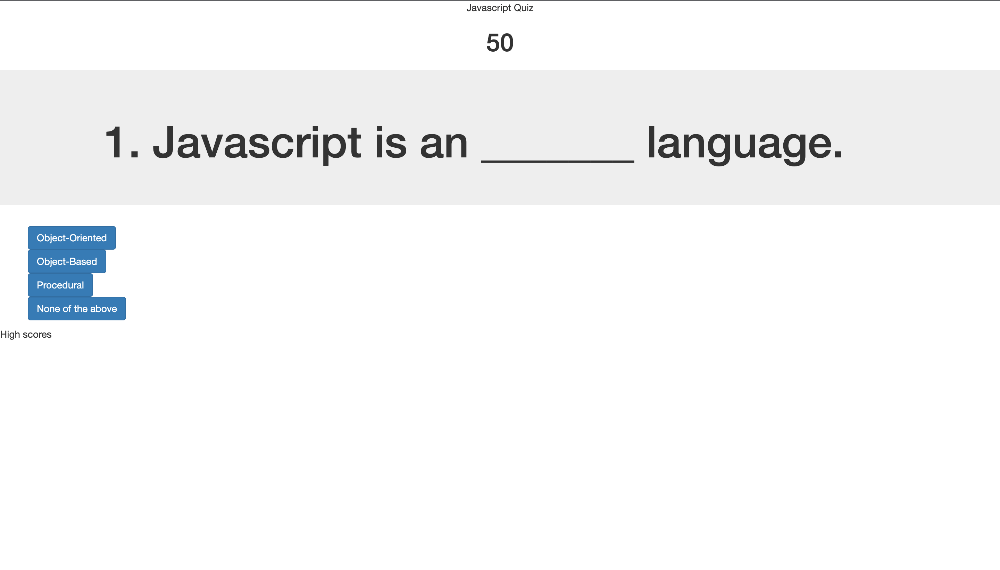

# module4-javascript-quiz
This week's harrowing challenge made me choose functionality over aesthetics. We were asked to put together a quiz about JS from scratch, making sure to include 
the use of local storage, loops, timers, and longer arrays.
It took me longer than expected to complete the task and eventually chose to focus more on making all the buttons work, than worrying about utilizing Bootstrap more efficiently.
With this project, due to its several inner-working, more care had to be given to the organization of the javascript file. I had to implement new strategies to keep me on track
and not become overhelmed with the to do lists. I need to focus more on getting 1 element 100% done and not all the elements 5% done. I think it would have been a much more 
efficient process had I done that. 

